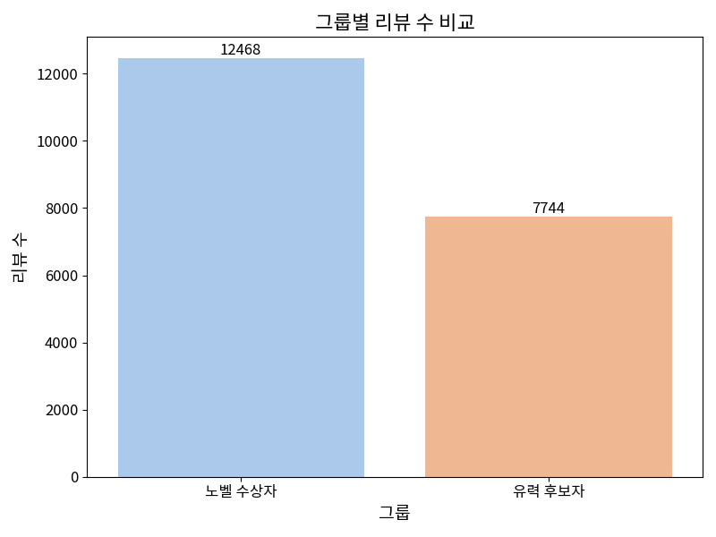
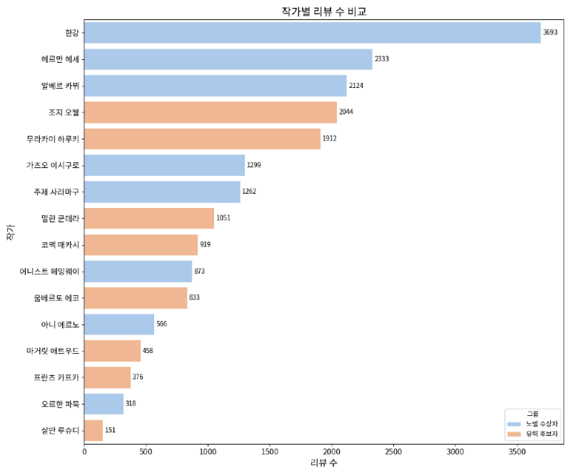
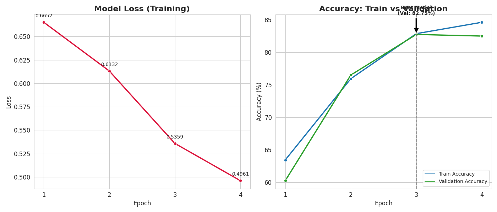

# 노벨문학상 데이터 분석 

## 1. 개요

### 1-1. 프로젝트 배경

최근 대한민국 문학계는 한강 작가의 노벨문학상 수상이라는 역사적인 이벤트를 경험했다. 이러한 수상은 단순히 작가 개인의 영광을 넘어, 
사회 전반에 걸쳐 도서에 대한 국민적 관심을 폭발적으로 상승시켰으며 노벨문학상에 한 관심 역시 고조되었다. 일반 독자들은 노벨문학상에 대해 구체적으로 잘 알지 못하는 경우가 많다. 
이에 노벨문학상에 이제 관심 가지기 시작한 사람들은  "한강 작가가 어떠한 기준으로 노벨문학상을 수상하였는가?"라는 궁금증을 품게 된다.

### 1-2. 문제 정의

노벨 문학상은 설립 취지에 따라 '이상주의적 성향이 두드러지거나 인류에 가장 크게 기여한 문학 작품을 가진 작가에게 수여'된다는 명확하고도 이상적인 목표를 가지고 있다.

이 프로젝트는 노벨 수상 작가 그룹과 노벨 유력 후보 작가 그룹의 대표작 리뷰에 긍부정을 예측하는 모델을 개발하여 노벨 수상기준과 대중들의 시선이 어떻게 다른지 파악하고자 한다.

---

## 2. 데이터 수집

### 2-1. 수집 도서 선정 기준
노벨상 수상 기준과 대중의 시선 차이를 분석하기 위해, 리뷰가 많은 **노벨 문학상 수상 작가 8명**과 후보로 거론되는 빈도가 높은 **유력 후보 작가 8명**을 선정하여 각 작가의 대표작 3권씩, 총 **48권**의 도서를 분석 대상으로 선정했습니다.

| 수상 작가 | 대표작 | 유력 후보 작가 | 대표작 |
| :--- | :--- | :--- | :--- |
| **한강** | 채식주의자, 소년이 온다, 작별하지 않는다 | **무라카미 하루키** | 노르웨이의 숲, 1Q84, 해변의 카프카 |
| **헤르만 헤세** | 데미안, 수레바퀴 아래서, 싯다르타 | **밀란 쿤데라** | 참을 수 없는 존재의 가벼움, 농담, 불멸 |
| **알베르 카뮈** | 이방인, 페스트, 시지프 신화 | **조지 오웰** | 1984, 동물농장, 카탈로니아 찬가 |
| **가즈오 이시구로** | 나를 보내지 마, 남아 있는 나날, 클라라와 태양 | **마거릿 애트우드** | 시녀 이야기, 증언들, 그레이스 |
| **어니스트 헤밍웨이** | 노인과 바다, 무기여 잘 있거라, 누구를 위하여 종은 울리나 | **코맥 매카시** | 더 로드, 노인을 위한 나라는 없다, 핏빛 자오선 |
| **주제 사라마구** | 눈먼 자들의 도시, 눈뜬 자들의 도시, 도플갱어 | **프란츠 카프카** | 변신, 소송, 성 |
| **아니 에르노** | 세월, 단순한 열정, 빈 옷장 | **움베르토 에코** | 장미의 이름, 푸코의 진자, 제0호 |
| **오르한 파묵** | 내 이름은 빨강, 순수 박물관, 하얀 성 | **살만 루슈디** | 한밤의 아이들, 악마의 시, 조지프 앤턴 |

### 2-2. 크롤링

구글 드라이버를 활용하여 교보문고, Yes24, 알라딘 세 곳의 주요 온라인 서점에서 도서 정보를 수집했습니다. 각 서점의 웹 환경 및 보안 정책에 대응하기 위해 최적화된 **우회 전략**을 적용하여 수집한 도서 id를 통해
책에 대한 편향된 결과를 배제하기 위하여 서점의 한 책당 최대 리뷰 개수 500개로 제한하여 리뷰를 수집하였다.

- **교보문고** (Google 검색을 통한 우회 접근) : 교보문고는 웹 방화벽 봇 탐지 시스템이 민감하여 검색 페이지에 접근이 어려워 교보문고에 직접적인 검색 요청을 최소화하기 위해 구글에서 도서 목록 링크를 역으로 획득하는 방식으로 id를 수집하였다.

- **Yes24**(클릭 기반의 ID 추출) : yes24는 도서 목록 페이지에서 리뷰페이지로 이동하지 않는 문제를 해결하기 위해 실제 사용자의 행동인 클릭을 시뮬레이션하여 리뷰페이지에 접근하여 id를 수집하였다.

- **알라딘** (URL 직접 추출) : 알라딘은 다른 사이트에 비하여 복잡하지 않고 id가 검색 결과 링크에 명확하게 포함되어 있어 검색결과로 id를 수집하였다.
  수집한 id를 통해 리뷰를 수집할 때 구매자에 리뷰와 나머지 리뷰가 분리되어 있는 특성을 반영하여 두 리뷰 모두 수집하게 하였다.

---

## 3. 데이터

### 3-1. 수집된 데이터

교보문고에서 11,165개 yes24에서 7,950개 알라딘에서 4,058개를 합한 **총 23,173개** 수집했다.
| group | author | book | site | star | review |
| :--- | :--- | :--- | :--- | :--- | :--- |
| 수상 작가와 후보 작가을 구분하는 그룹명 | 작가 이름 | 책 이름 | 수집한 사이트 이름| 별점 | 리뷰 |

### 3-2. 데이터 전처리 

1. **중복 제거** : 중복된 리뷰를 제거했다.
2. **길이 제한** : 최소 글자를 5글자로 선정하여 의미 없는 리뷰를 제거했다.
3. **노이즈 필터링** : 도서의 내용과 무관한 배송 문제, 번역 품질 등에 대한 리뷰를 키워드 기반으로 필터링하여 제거했다.

총 23,173개인 데이터를 전처리 후 **총 20,212개**로 변경됐다

### 3-3. 데이터 라벨링

| 서점 | 평점 스케일 | 부정(0) 기준 | 긍정(1) 기준 |
| :--- | :--- | :--- | :--- |
| **교보문고** | 0~4점 | **0 ~ 2점** | **3 ~ 4점** |
| **Yes24** | 0~10점 | **0 ~ 5점** | **6 ~ 10점** |
| **알라딘** | 2~10점 (2점 단위) | **2, 4, 6점** | **8, 10점** |

### 3-4. 데이터 통계

- **그룹별 리뷰 개수**

전체 데이터셋에서 노벨 수상자 그룹과 유력 후보자 그룹의 표본 크기가 수상자 그룹의 리뷰 수가 더 크지만 대등한 비율을 유지하고 있다.

- **작가별 리뷰 개수**

작가별 리뷰 수는 특정(한강, 무라카미 하루키)작가에게 데이터가 집중되어 다른 작가와 리뷰 수가 확연한 차이를 보인다.

### 3-5. 학습 데이터

총 20,212개 리뷰에서 10%인 2천개를 별점으로 라벨링한 **부정 1,001개 긍정 999개**로 구성하여 추출하고 직접 라벨링하여 **부정 744개 긍정 1,256개**로 변경한 학습데이터로 구성했다.

---

## 4. 모델링(koelectra)

- **학습 결과**

Epoch | Train Loss | Train Accuracy | Validation Accuracy |
| :---: | :---: | :---: | :---: | 
| 1 | 0.6652 | 63.44% | 60.25% | 
| 2 | 0.6132 | 75.94% | 76.50% | 
| 3| 0.5359| 82.87% | 82.75% | 
| 4 | 0.4961 | 84.62% | 82.50% | 

학습 결과 Loss는 꾸준히 줄고, Accuracy는 늘어나고 있다. Epoch 3에서 검증 정확도 최고점을 찍고 Epoch 4에서는 약간 떨어지는 모습봤을 때 과적합 징후가 있어 **Epoch 3의 가중치**를 최종 모델로 선정했다

---
## 5. 분석

모델의 예측 결과와 확신도 데이터를 기반으로, 수상작과 후보작 간의 심층적인 비교 분석을 수행했다.

### 5-1. 그룹별 긍정 반응 비율 
모델이 예측한 긍정 리뷰의 비율을 그룹별로 비교 분석했다.

| 그룹 (Group) | 평균 긍정 비율 | 해석 |
| :--- | :---: | :--- |
| **유력 후보 작가** |**84.2%**| 대중적 지지가 압도적임. "재미있다", "시간 가는 줄 몰랐다"는 주류 반응. |
| **수상 작가** |**68.5%**| 후보 작가 대비 **약 15.7% 낮음**. 호불호가 명확히 갈림. |

- **인사이트**: 노벨상 수상작은 대중에게 마냥 '좋은(긍정)' 책으로만 읽히지 않는다. 난해함, 불편한 소재, 무거운 주제 의식 등으로 인해 **부정적이거나 복합적인 감정**을 유발하는 경향이 뚜렷하다.

### 5-2. 감성 확신도 분포 
모델이 긍정/부정을 판단할 때 가졌던 **확신**의 정도를 분석했다.

* **후보 작가 그룹:**
    * 예측 확률이 **0.9 이상(확실한 긍정)** 이거나 **0.1 이하(확실한 부정)** 인 양극단 분포가 뚜렷하다.
    * 즉, 독자의 반응이 직관적이고 명쾌하다.
* **수상 작가 그룹:**
    * 확률이 **0.4 ~ 0.6 (애매함/중립)** 구간에 분포하는 리뷰가 다수 발견되었다.
    * **실제 리뷰 예시:** *"읽는 내내 고통스러웠지만(부정), 책을 덮고 나니 여운이 길다(긍정)."*
    * **결과:** 수상작은 단일 감정으로 정의하기 어려운 **'복합적'** 감상을 이끌어낸다.

### 5-3. 사례 연구: 한강 vs 살만 루슈디 비교
데이터 내에서 가장 대조적인 반응을 보인 두 작가의 대표작을 구체적으로 비교했다.

**1. 한강 (수상 작가) - 『채식주의자』**
* **주요 키워드:** `#충격` `#폭력` `#고통` `#이해불가` `#압도적`
* **분석:** "불편하다"는 거부 반응과 "압도적이다"는 찬사가 공존한다. 대중적인 재미보다는 **충격적인 문체와 시대적 고통을 다루는 주제의식**이 노벨상의 기준임을 보여준다.

**2. 살만 루슈디 (후보 작가) - 『악마의 시』**
* **주요 키워드:** `#기대` `#이야기꾼` `#환상` `#매력` `#걸작`
* **분석:** 작가의 화려한 입담과 스토리텔링 능력에 대한 찬사가 주를 이루며, **대중적 서사의 힘**이 강점임을 확인했다.

---

## 6. 결론 

### 6-1. 노벨 문학상의 선정 기준: "불편함의 미학"
데이터 분석 결과, 스웨덴 아카데미는 대중이 느끼는 단순한 '재미'나 '카타르시스'보다는 **인간 내면의 고통을 직시하거나(한강)**, **기존의 관념을 파괴하는(카뮈, 사라마구)** 작품에 높은 가치를 부여한다는 것을 정량적으로 확인할 수 있었다.

### 6-2. 대중과의 간극
* **대중 :** 가독성이 좋고, 서사가 명확하며, 감정적 만족을 주는 작품을 선호한다. (후보 작가 그룹 우세)
* **노벨상 :** 다소 읽기 불편하고 난해하더라도, 묵직한 질문을 던지는 작품을 선택한다. (수상 작가 그룹 우세)

### 6-3. 프로젝트 의의
막연하게 느껴졌던 '문학성'이라는 추상적 가치를 **2만여 건의 리뷰 데이터와 모델**을 통해 정량적으로 시각화하여 노벨상은 '베스트셀러'를 뽑는 상이 아니라, **'시대를 관통하는 질문'**을 던지는 작가에게 주어진다는 것을 데이터로 증명했다.

---

